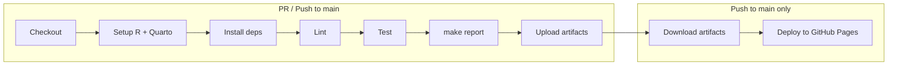

# Architecture

## Pipeline Flow

```
data (synthetic/raw) → validate → metrics → report
```

1. **Data**: Synthetic data generated (`R/synthetic_data.R`) or raw input. Written to `data/synthetic/visits.parquet`.
2. **Validate**: Contract validation (`R/contract_validate.R`) against `data_contract/contract.yaml`. Fails pipeline on errors; warnings are logged.
3. **Metrics**: `compute_metrics()` and `make_plots()` produce summary tables and figures.
4. **Report**: Quarto renders `report.qmd` to `output/report.html`, using metrics and plots.

All steps are orchestrated by `targets` in `_targets.R`.

---

## CI/CD Flow



- **On PR and push**: Lint (optional), test, run pipeline, upload `output/report.html` and `data/synthetic/visits.parquet`.
- **On push to main**: Same, plus deploy report to GitHub Pages.

---

## GitOps Flow

**Argo CD** or **Flux** watches this repo and syncs manifests from `k8s/overlays/<env>`.

**Argo CD** (example):

```yaml
# Application pointing at k8s/overlays/dev
apiVersion: argoproj.io/v1alpha1
kind: Application
metadata:
  name: phds-pipeline-dev
spec:
  source:
    repoURL: https://github.com/org/phds-data-pipeline-as-code
    path: k8s/overlays/dev
    targetRevision: main
  destination:
    server: https://kubernetes.default.svc
    namespace: phds-dev
  syncPolicy:
    automated:
      prune: true
      selfHeal: true
```

**Flux** (example):

```yaml
apiVersion: kustomize.toolkit.fluxcd.io/v1
kind: Kustomization
metadata:
  name: phds-pipeline-dev
spec:
  sourceRef:
    kind: GitRepository
    name: phds-data-pipeline-as-code
  path: ./k8s/overlays/dev
  interval: 1m
  prune: true
```

Both tools poll Git, run `kustomize build` on the overlay, and apply the result. Changes to schedule, ConfigMap, or image tag in Git are synced to the cluster without manual `kubectl apply`.

---

## Image Tags

**Current**: Manual. Build the image, push to a registry, and update the image reference in `k8s/base/cronjob.yaml` or overlays. Commit the change; GitOps syncs it.

**Possible automation**: CI builds the image on merge to main, tags with commit SHA or `latest`, pushes to a registry. A separate step or tool (e.g. image-updater for Argo CD, Flux image automation) updates the manifest with the new tag and commits it, or the CronJob uses a mutable tag like `latest`.

---

## Real Environment Checklist

| Need | Purpose |
|------|---------|
| **Container registry** | Push images (GHCR, ECR, GCR). CronJob pulls from here. |
| **Secrets** | Store registry credentials (`imagePullSecrets`), API keys if the pipeline fetches external data. |
| **PVC** | Replace EmptyDir if outputs must persist across runs or be shared. |
| **RBAC** | ServiceAccount with minimal permissions; restrict who can edit CronJob/ConfigMap. |
| **Network** | Egress for CRAN, Quarto, etc. NetworkPolicy if required. |
| **Resource quotas** | Namespace quotas to cap CPU/memory usage. |

---

## Next Steps / TODOs

- Populate `renv.lock` via `renv::snapshot()` for reproducible CI and local builds.
- Wire `_targets.R` to use ConfigMap env vars (SEED, N_PATIENTS, N_VISITS) when running in Kubernetes.
